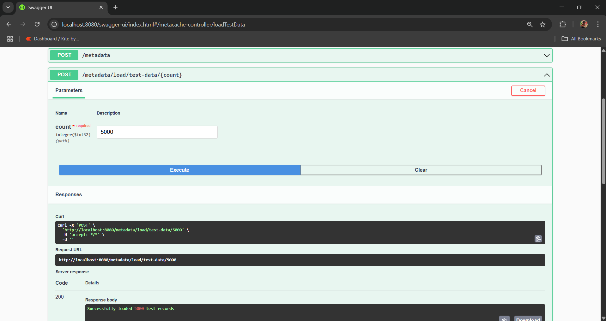

# MetaStore - Distributed Caching and Data Management System

<p align="center">
  
</p>

MetaStore is a high-performance distributed system for metadata management, combining Redis caching and PostgreSQL persistence.

**Key Features:**
- 🔍 Comprehensive search: Search any keyword across the database and get matching metadata
- ⚡ Fast repeated queries: First search hits the DB, subsequent ones are served instantly from cache
- 🗃️ Efficient CRUD operations for metadata
- 🧠 Smart cache invalidation ensures data accuracy and freshness
- 🚀 18x–25x faster data and search retrieval with caching
- 📊 Response statistics for source (cache/DB) and time taken
- 🔑 Redis stores data under multiple keys for flexible access patterns
- 🛡️ Seamless integration with PostgreSQL for reliable persistence
- 🧩 On-demand DataLoader to generate and load test data for the application

## Prerequisites

- Java 17
- Docker
- Git

## System Architecture

The system follows a microservices architecture with the following components:

### MetaCache Service
[MetaCache Swagger UI](http://localhost:8080/swagger-ui.html)


- **URL**: http://localhost:8080/swagger-ui.html
- **Purpose**: Handles caching operations using Redis
- **Features**:
  - Efficient data caching
  - Cache invalidation mechanisms to ensure data accuracy
  - Cache statistics
  - Real-time cache monitoring

### MetaClient Service
[MetaClient Swagger UI](http://localhost:8081/swagger-ui.html)


- **URL**: http://localhost:8081/swagger-ui.html
- **Purpose**: Manages data persistence and retrieval
- **Features**:
  - Data CRUD operations
  - Comprehensive search functionality (search any keyword across the database and return matching metadata)
  - Cache integration for efficient repeated searches
  - Data validation

### DataLoader (On-Demand Test Data Generation)

- **Purpose:** Instantly generate and load test data into the application for development and testing
- **How it works:**
  - Provides endpoints to populate the database with sample assets/metadata
  - Useful for demos, testing, and performance benchmarking
- **Sample Response:**
```json
{
  "data": [
    {
      "id": "0df3d3f9-800d-4634-a485-6600d261c3ee",
      "name": "Test Asset 0",
      "type": "Bond",
      "issuer": "Vanguard",
      "riskRating": "Low"
    },
    {
      "id": "996831f7-cc61-45ab-ba1d-14cf27e82e72",
      "name": "Test Asset 1",
      "type": "Mutual Fund",
      "issuer": "Vanguard",
      "riskRating": "Medium"
    }
  ],
  "timeTakenMs": 21.45189,
  "source": "DB"
}
```

## Infrastructure Components

### PostgreSQL Database


- **Host**: localhost
- **Port**: 5432
- **Database**: metastore
- **Username**: postgres
- **Password**: postgres

### Redis Cache


- **Host**: localhost
- **Port**: 6379
- **No password set**

## Getting Started

1. Clone the repository:
```bash
git clone <repository-url>
cd metastore
```

2. Start the services:
```bash
docker-compose up --build
```

3. Verify the services are running:
```bash
docker ps
```

### Service Management

#### View Logs
```bash
# All services
docker-compose logs -f

# Specific service
docker-compose logs -f [service-name]
```

#### Stop Services
```bash
docker-compose down -v
```

#### Rebuild Services
```bash
docker-compose up --build
```

## Data Flow, Performance, and Search Efficiency

### Data Flow and Performance Comparison (5000 Records)

<div align="center" style="margin-bottom: 16px;">
  
  
</div>

- **With Database**: ~247 ms
- **With Cache**: ~13 ms

This demonstrates an average efficiency improvement of over **18x** when using the cache for large data retrievals.

### Search Functionality and Caching (Comprehensive Search)

<div align="center" style="margin-bottom: 16px;">
  
  
</div>

- **Search with Database**: ~76 ms
- **Search with Cache**: ~3 ms

This results in a **25x** improvement in search response time on average for repeated queries.

### Cache Operations

The Redis cache stores data under different keys for various use cases, such as:
- `all`: All records
- `search`: Search results
- `issuers`, `types`, `id`: Specific metadata categories

This structure enables fast and efficient data access for different query patterns.

---

## Thank You

Thank you for exploring and contributing! If you have any questions, suggestions, or contributions, feel free to reach out or open an issue.